<a id="readme-top"></a>

<!-- PROJECT LOGO -->

<br />
<div align="center">
  <a href="https://github.com/M1KUAPP/MediaFlows">
    <picture>
      <source media="(prefers-color-scheme: dark)" srcset="docs/readme/banner-dark.png">
      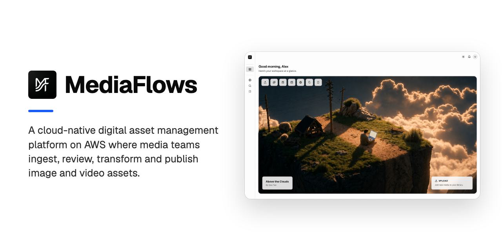
    </picture>
  </a>

  <h3>MediaFlows</h3>

  <p>
    A cloud-native digital asset management platform on AWS where media teams ingest, review, transform and publish image and video assets.
    <br />
    <a href="#getting-started"><strong>Run Locally »</strong></a>
    &middot;
    <a href="#screenshots">Screenshots</a>
    &middot;
    <a href="https://github.com/M1KUAPP/MediaFlows/issues/new?labels=bug">Report a Bug</a>
    <br />
  </p>

[![TypeScript][typescript-badge]][typescript-url]
[![C#][c-badge]][c-url]
[![Next.js][nextjs-badge]][nextjs-url]
[![React][react-badge]][react-url]
[![Tailwind CSS][tailwindcss-badge]][tailwindcss-url]
[![shadcn/ui][shadcnui-badge]][shadcnui-url]
[![.NET][net-badge]][net-url]
[![PostgreSQL][postgresql-badge]][postgresql-url]
[![Amazon DynamoDB][amazondynamodb-badge]][amazondynamodb-url]
[![AWS][aws-badge]][aws-url]
[![AWS Lambda][awslambda-badge]][awslambda-url]
[![Terraform][terraform-badge]][terraform-url]
[![Playwright][playwright-badge]][playwright-url]
[![pnpm][pnpm-badge]][pnpm-url]

</div>

<!-- TABLE OF CONTENTS -->

## Table of Contents

<details>
  <summary>Expand</summary>
  <ol>
    <li>
      <a href="#about-the-project">About The Project</a>
      <ul>
        <li><a href="#screenshots">Screenshots</a></li>
        <li><a href="#how-it-works">How It Works</a></li>
        <li><a href="#features">Features</a></li>
        <li><a href="#architecture">Architecture</a></li>
        <li><a href="#tech-stack">Tech Stack</a></li>
      </ul>
    </li>
    <li>
      <a href="#getting-started">Getting Started</a>
      <ul>
        <li><a href="#prerequisites">Prerequisites</a></li>
        <li><a href="#installation">Installation</a></li>
      </ul>
    </li>
    <li><a href="#roadmap">Roadmap</a></li>
    <li><a href="#team">Team</a></li>
    <li><a href="#license">License</a></li>
    <li><a href="#acknowledgments">Acknowledgments</a></li>
  </ol>
</details>

<!-- ABOUT THE PROJECT -->

## About The Project

MediaFlows is a Digital Asset Management (DAM) platform that lets media teams ingest, organize, transform, and distribute large volumes of image and video assets from a single workspace. It pairs a Next.js web app with an API-only ASP.NET Core backend on AWS, fronted by Cognito-backed SSO and a CloudFront-served asset CDN.

The repository is split into four workloads, with the deployable apps under `apps/` and the Terraform under `infra/`:

- `apps/web/` — Next.js 16 (App Router) + React 19 + Tailwind v4 web app, deployed to AWS Amplify Hosting.
- `apps/api/` — ASP.NET Core 8 solution (`MediaFlows.Web`, `MediaFlows.Data`, `MediaFlows.Shared`) deployed to Elastic Beanstalk, with the .NET tests in `apps/api/tests/`.
- `apps/lambdas/` — supporting AWS Lambda functions for async asset processing.
- `infra/` — Terraform (bootstrap + main stack) provisioning the full AWS estate.

Built as coursework, where it earned an A+.

<p align="right"><a href="#readme-top">&uarr;</a></p>

### Screenshots

<table>
  <tr>
    <td width="50%" valign="top" align="left">
      
      <br />
      <strong>Landing Page</strong> · A cinematic entry point into the workspace.
    </td>
    <td width="50%" valign="top" align="left">
      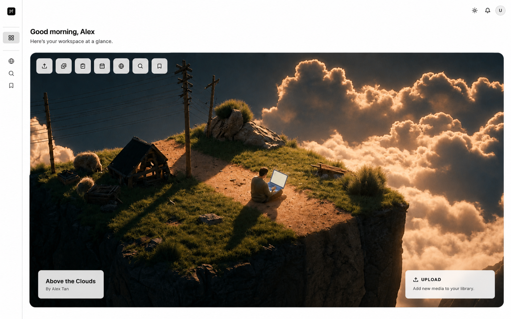
      <br />
      <strong>Dashboard</strong> · Personalized greeting, role-based quick actions, and a recent-assets carousel.
    </td>
  </tr>
  <tr>
    <td width="50%" valign="top" align="left">
      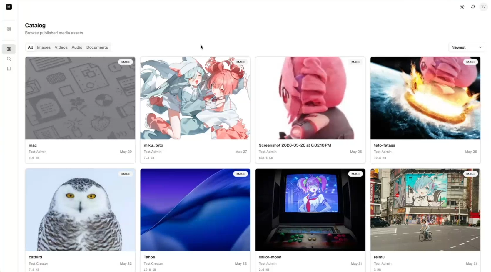
      <br />
      <strong>Catalog</strong> · Browse published media with content-type filters and trending sort.
    </td>
    <td width="50%" valign="top" align="left">
      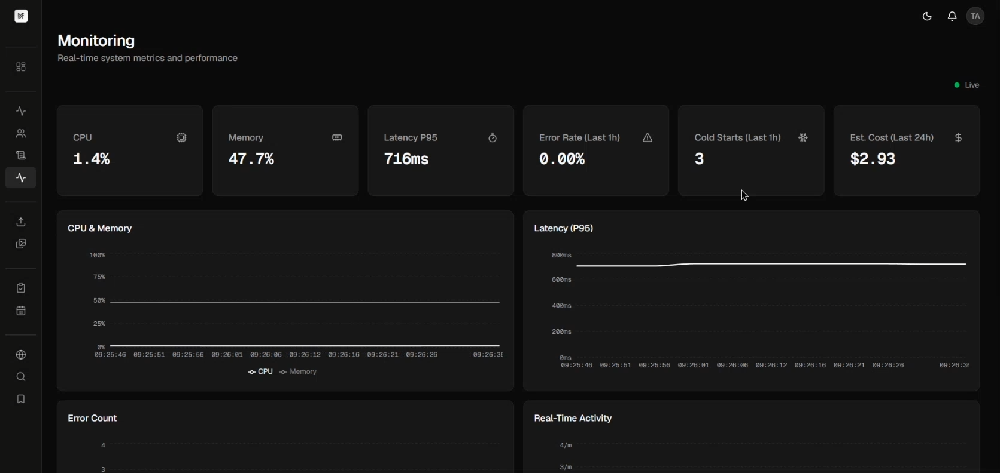
      <br />
      <strong>Live Monitoring</strong> · Real-time CPU, latency, error-rate, and cost metrics with streaming charts.
    </td>
  </tr>
  <tr>
    <td width="50%" valign="top" align="left">
      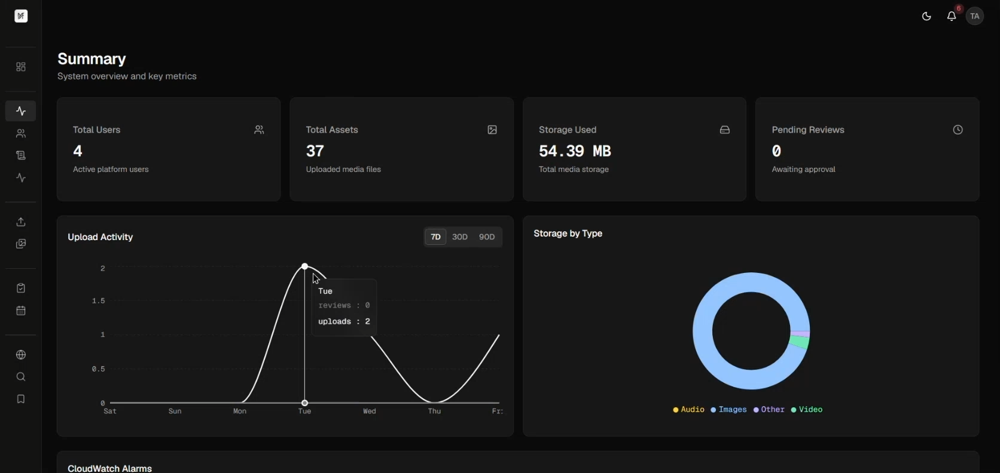
      <br />
      <strong>Admin Summary</strong> · Platform KPIs, upload-activity trends, storage breakdown, and CloudWatch alarms.
    </td>
    <td width="50%" valign="top" align="left">
      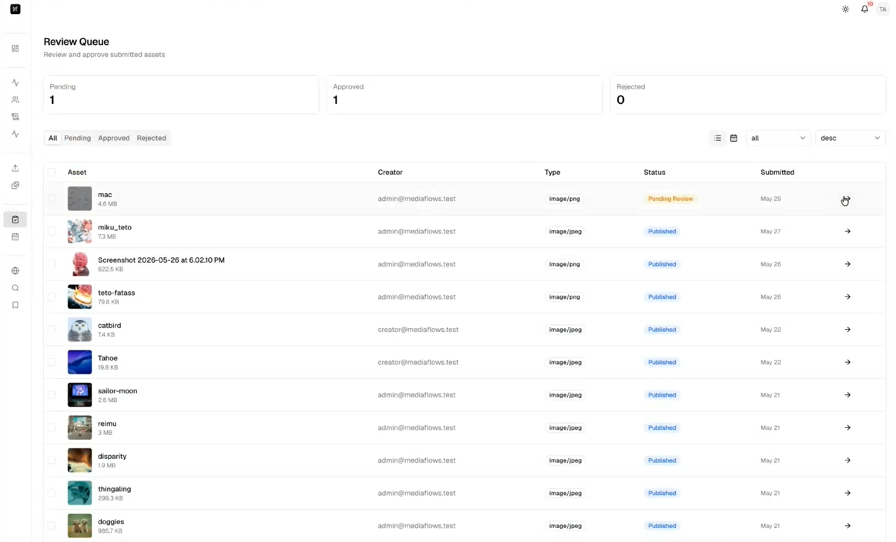
      <br />
      <strong>Review Queue</strong> · Triage submissions with status filters and batch approve / reject / schedule.
    </td>
  </tr>
  <tr>
    <td width="50%" valign="top" align="left">
      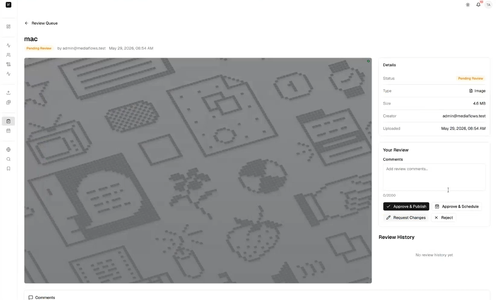
      <br />
      <strong>Review &amp; Decide</strong> · Inspect an asset, leave comments, and approve, schedule, or reject.
    </td>
    <td width="50%" valign="top" align="left"></td>
  </tr>
</table>

<p align="right"><a href="#readme-top">&uarr;</a></p>

### How It Works

1.  **Enter the workspace.** The landing page at `/` links to sign-in. New users register at `/register`, enter the six-digit code that Cognito emails them at `/confirm`, and sign in at `/login`. A post-confirmation Lambda adds every new account to the `Viewer` group.

    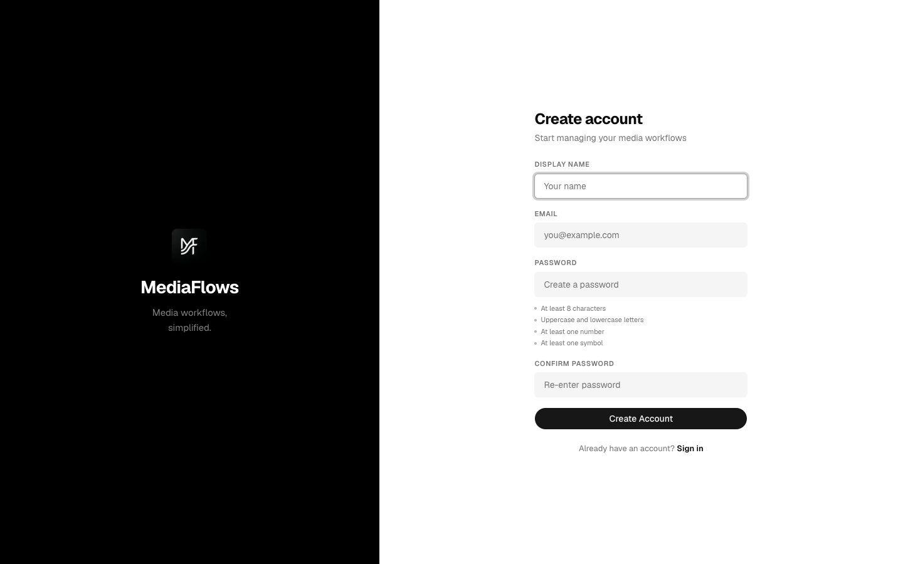

2.  **Start from the dashboard.** `/dashboard` greets you and shows a carousel of recent assets. The sidebar lists only the pages your role (`SystemAdmin`, `ContentCreator`, `Editor` or `Viewer`) can open.

    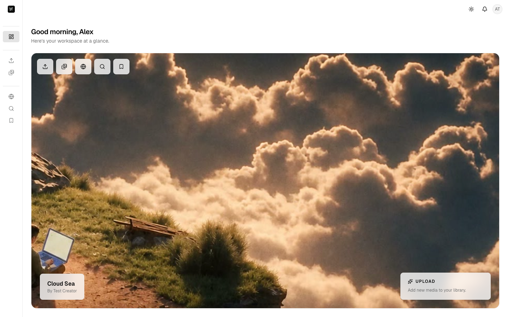

3.  **Upload media.** Content creators drop files on `/creator/upload`. The browser sends each file straight to S3 through a presigned URL, then confirms the upload with the API. For images, Lambda functions then generate WebP thumbnails and Rekognition auto-tags in the background.

    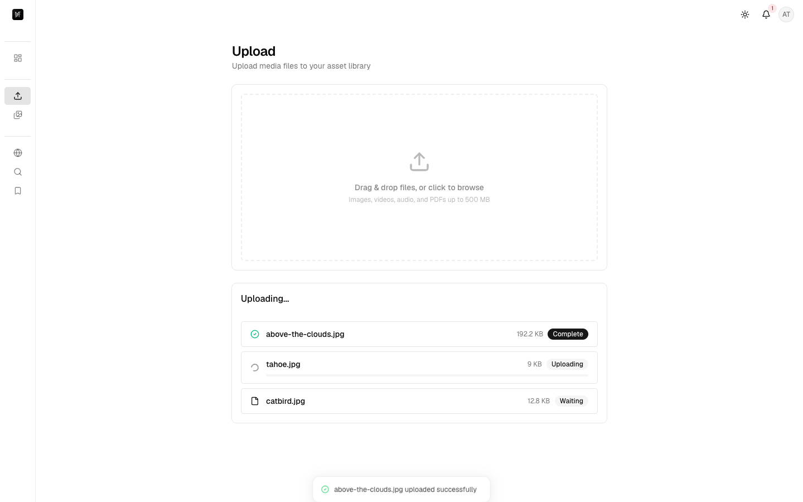

4.  **Prepare assets for review.** `/creator/assets` lists the creator's asset library. On an asset's page, creators edit tags, read comments, and open the version history to upload, compare or revert versions. They then submit one asset or a batch for review.

    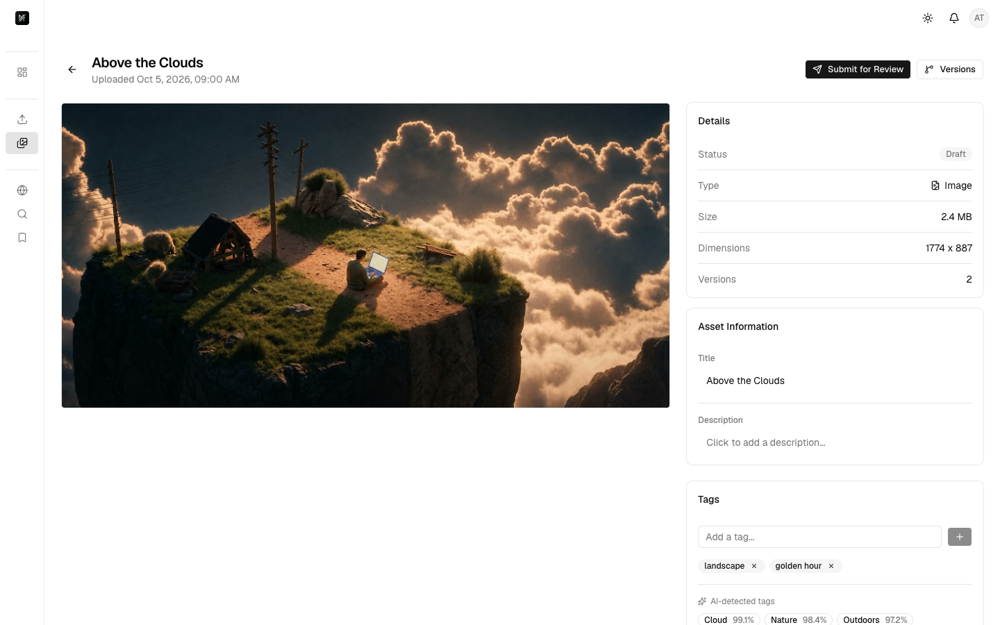

5.  **Review submissions.** Editors triage the queue at `/review` with status filters and batch approve, reject or schedule. On an asset's review page, they leave comments, then approve, request changes, reject or schedule it.

    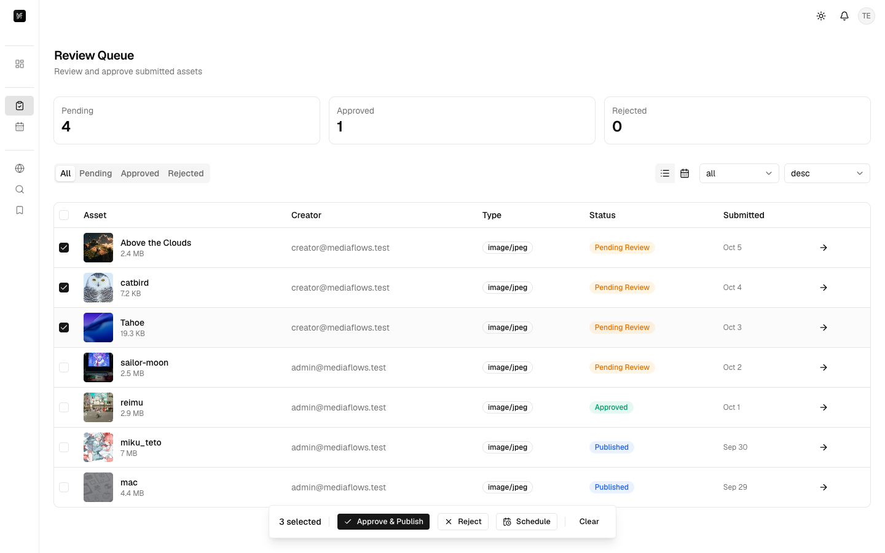

6.  **Schedule publication.** `/schedule` shows a publishing calendar for approved assets. The API publishes each scheduled asset once its time arrives.

    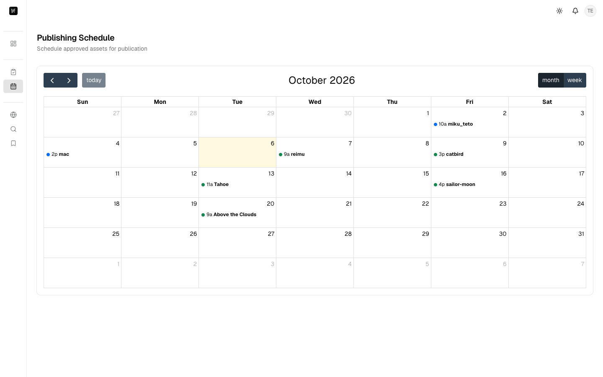

7.  **Browse and share.** Every role can browse published media at `/catalog` with content-type filters and a trending sort, search with autocomplete at `/search`, and save assets to `/bookmarks`. An asset's page lets them download it or copy a share link.

    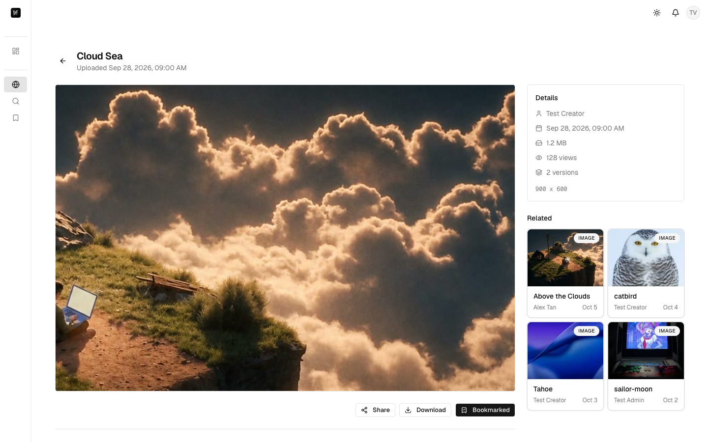

8.  **Run the platform.** System admins read platform KPIs at `/admin`, manage users and their roles at `/admin/users`, filter audit logs at `/admin/audit-logs`, and watch live metrics at `/admin/monitoring`.

    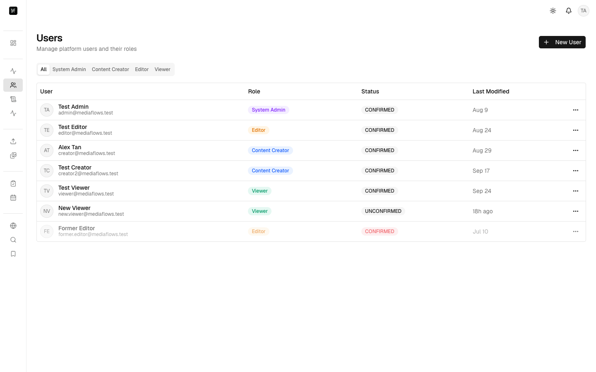

<p align="right"><a href="#readme-top">&uarr;</a></p>

### Features

- **Role-based access.** Four Cognito roles (`SystemAdmin`, `ContentCreator`, `Editor`, `Viewer`), enforced by API authorization policies and the sidebar. Self-service sign-up with email confirmation, plus forgot-password and reset-password flows.
- **Direct-to-S3 uploads.** Drag-and-drop uploads that go straight to S3 through presigned URLs, with per-file progress. The `ThumbnailGenerator` Lambda generates WebP thumbnails.
- **Auto-tags and moderation.** Rekognition auto-tags with confidence scores, plus manual tag editing. Content flagged by Rekognition moderation moves to a quarantine prefix.
- **Versions and comments.** Version history with version upload, compare, and revert, plus threaded comments on assets.
- **Review workflow.** Approve, request changes, reject, and schedule decisions, a status timeline, and batch actions. Review-decision events go to EventBridge and are sent as email through SNS when a subscriber is configured.
- **Publishing calendar.** A background worker publishes scheduled assets every minute.
- **Trending catalog.** Content-type filters and a trending sort, ranked daily from view counts in DynamoDB.
- **Search and sharing.** Search with autocomplete, bookmarks, share links, and downloads.
- **Real-time updates.** Notifications and live analytics over SignalR.
- **Admin console.** Platform KPIs, user management, audit logs, and live CloudWatch metrics and alarms with cost estimates.
- **Light and dark themes.** The theme follows the system setting.

<p align="right"><a href="#readme-top">&uarr;</a></p>

### Architecture

<picture>
  <source media="(prefers-color-scheme: dark)" srcset="docs/readme/architecture-dark.svg">
  
</picture>

The diagram is drawn with [archify](https://github.com/tt-a1i/archify) from [`architecture.json`](docs/readme/architecture.json).

Once deployed behind a custom domain, MediaFlows serves four endpoints:

| Subdomain        | Service                                |
| ---------------- | -------------------------------------- |
| `web.<domain>`   | Next.js frontend (AWS Amplify Hosting) |
| `api.<domain>`   | ASP.NET Core API (Elastic Beanstalk)   |
| `login.<domain>` | Cognito Hosted UI                      |
| `cdn.<domain>`   | CloudFront asset delivery              |

The frontend talks to the API over HTTPS and SignalR (realtime hub), assets are delivered via the CloudFront CDN, and async processing runs through the Lambda pipeline. See [`infra/README.md`](infra/README.md) for how the AWS estate is provisioned.

<p align="right"><a href="#readme-top">&uarr;</a></p>

### Tech Stack

- **Languages:** TypeScript 5 and C#.
- **Frontend:** Next.js 16 (App Router), React 19, Tailwind CSS 4, shadcn/ui on Base UI, TanStack Query, NextAuth 5 beta, Recharts, FullCalendar, and the SignalR client.
- **Backend:** ASP.NET Core 8, Entity Framework Core 8 with Npgsql, SignalR, Serilog, Swashbuckle, the AWS SDK for .NET, and AWS Lambda on .NET 8 with ImageSharp.
- **Data:** PostgreSQL on Amazon RDS, Amazon DynamoDB, and Amazon S3.
- **AI and services:** Amazon Rekognition.
- **Infrastructure:** Terraform with the AWS and TLS providers, AWS Amplify Hosting, Elastic Beanstalk, CloudFront, Cognito, SQS, SNS, EventBridge, API Gateway, Route 53, CloudWatch, and X-Ray.
- **Tooling:** pnpm and ESLint, plus xUnit, Moq, and FluentAssertions for .NET tests and Playwright for end-to-end tests.

<p align="right"><a href="#readme-top">&uarr;</a></p>

<!-- GETTING STARTED -->

## Getting Started

The frontend and the backend run locally from the repository root, and the frontend needs Cognito and API values in `.env.local`. See the [frontend README](apps/web/README.md) for more.

<p align="right"><a href="#readme-top">&uarr;</a></p>

### Prerequisites

- [Bun](https://bun.sh/) 1.4.2 — for the repository tooling and `bun run check`.
- [Node.js](https://nodejs.org/) 20+ — for the frontend.
- [pnpm](https://pnpm.io/) 9+ — for the frontend.
- [.NET SDK](https://dotnet.microsoft.com/) 8 — for the backend.
- [AWS CLI](https://aws.amazon.com/cli/) v2 with a `mediaflows` profile — for deploys and SSM lookups.
- [Terraform](https://www.terraform.io/) 1.6+ — for `infra/`.

<p align="right"><a href="#readme-top">&uarr;</a></p>

### Installation

1.  **Clone the repo.**

    ```sh
    git clone https://github.com/M1KUAPP/MediaFlows.git
    cd MediaFlows
    ```

2.  **Start the frontend.** From the repository root:

    ```sh
    cd apps/web
    pnpm install
    cp .env.production.example .env.local    # fill in Cognito + API values
    pnpm dev                                 # http://localhost:3000
    ```

3.  **Start the backend.** In another terminal, from the repository root:

    ```sh
    dotnet restore MediaFlows.slnx
    dotnet run --project apps/api/MediaFlows.Web --launch-profile http  # http://localhost:5140
    ```

4.  **Provision AWS when needed.** Separately, from the repository root:

    ```sh
    make deploy  # see infra/README.md
    ```

    The repository has no CI, and deploys are manual: `make deploy` provisions the AWS infrastructure and `make apply` applies later changes. The exception is the frontend, which Amplify Hosting builds from `main` once provisioned. No script deploys the API or Lambda code. The removed workflows are linked at their last commit for reference: [`deploy.yml`](https://github.com/M1KUAPP/MediaFlows/blob/6b2c63289af4207f6d723888810c32913e53d143/.github/workflows/deploy.yml) built and uploaded the API and Lambda code, and [`terraform-apply.yml`](https://github.com/M1KUAPP/MediaFlows/blob/6b2c63289af4207f6d723888810c32913e53d143/.github/workflows/terraform-apply.yml) ran `terraform apply`. Workload-specific instructions live in [`apps/web/README.md`](apps/web/README.md) and [`infra/README.md`](infra/README.md).

5.  **Run the checks.** From the repository root, run `bun install` once for the root tooling and Git hooks. `bun run check` runs editorconfig-checker, Prettier, the frontend typecheck, and `dotnet test MediaFlows.slnx` when `dotnet` is installed. ESLint (`pnpm lint`) and the Playwright suite (`pnpm test:e2e`, against `http://localhost:3000`) run separately in `apps/web/`.

    ```sh
    bun run check
    ```

<p align="right"><a href="#readme-top">&uarr;</a></p>

<!-- ROADMAP -->

## Roadmap

See [open issues](https://github.com/M1KUAPP/MediaFlows/issues) for a full list of proposed features (and known issues).

<p align="right"><a href="#readme-top">&uarr;</a></p>

<!-- CONTRIBUTING -->

## Team

<a href="https://github.com/M1KUAPP/MediaFlows/graphs/contributors">
  
</a>

Made with [contrib.rocks](https://contrib.rocks).

<p align="right"><a href="#readme-top">&uarr;</a></p>

<!-- LICENSE -->

## License

See [LICENSE](LICENSE) for more information.

<p align="right"><a href="#readme-top">&uarr;</a></p>

<!-- ACKNOWLEDGMENTS -->

## Acknowledgments

- [shadcn/ui](https://ui.shadcn.com) — UI components.
- [Lucide](https://lucide.dev) — icons.
- [Geist](https://vercel.com/font) — typefaces.
- [archify](https://github.com/tt-a1i/archify) — architecture diagrams.
- [Shields.io](https://shields.io)
- [contrib.rocks](https://contrib.rocks)

<p align="right"><a href="#readme-top">&uarr;</a></p>

<!-- MARKDOWN LINKS & IMAGES -->

[typescript-badge]: https://img.shields.io/badge/TypeScript-3178C6?style=for-the-badge&logo=typescript&logoColor=white
[typescript-url]: https://www.typescriptlang.org/
[c-badge]: https://img.shields.io/badge/C%23-512BD4?style=for-the-badge
[c-url]: https://learn.microsoft.com/dotnet/csharp/
[nextjs-badge]: https://img.shields.io/badge/Next.js-000000?style=for-the-badge&logo=nextdotjs&logoColor=white
[nextjs-url]: https://nextjs.org/
[react-badge]: https://img.shields.io/badge/React-61DAFB?style=for-the-badge&logo=react&logoColor=black
[react-url]: https://react.dev/
[tailwindcss-badge]: https://img.shields.io/badge/Tailwind_CSS-06B6D4?style=for-the-badge&logo=tailwindcss&logoColor=white
[tailwindcss-url]: https://tailwindcss.com/
[shadcnui-badge]: https://img.shields.io/badge/shadcn%2Fui-000000?style=for-the-badge&logo=shadcnui&logoColor=white
[shadcnui-url]: https://ui.shadcn.com/
[net-badge]: https://img.shields.io/badge/.NET-512BD4?style=for-the-badge&logo=dotnet&logoColor=white
[net-url]: https://dotnet.microsoft.com/
[postgresql-badge]: https://img.shields.io/badge/PostgreSQL-4169E1?style=for-the-badge&logo=postgresql&logoColor=white
[postgresql-url]: https://www.postgresql.org/
[amazondynamodb-badge]: https://img.shields.io/badge/Amazon_DynamoDB-4053D6?style=for-the-badge
[amazondynamodb-url]: https://aws.amazon.com/dynamodb/
[aws-badge]: https://img.shields.io/badge/AWS-FF9900?style=for-the-badge
[aws-url]: https://aws.amazon.com/
[awslambda-badge]: https://img.shields.io/badge/AWS_Lambda-FF9900?style=for-the-badge
[awslambda-url]: https://aws.amazon.com/lambda/
[terraform-badge]: https://img.shields.io/badge/Terraform-844FBA?style=for-the-badge&logo=terraform&logoColor=white
[terraform-url]: https://www.terraform.io/
[playwright-badge]: https://img.shields.io/badge/Playwright-2EAD33?style=for-the-badge
[playwright-url]: https://playwright.dev/
[pnpm-badge]: https://img.shields.io/badge/pnpm-F69220?style=for-the-badge&logo=pnpm&logoColor=white
[pnpm-url]: https://pnpm.io/
